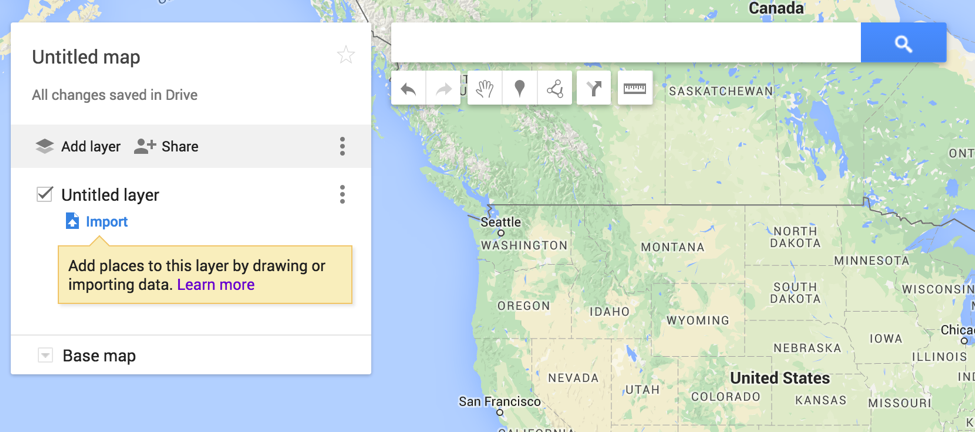
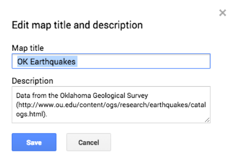
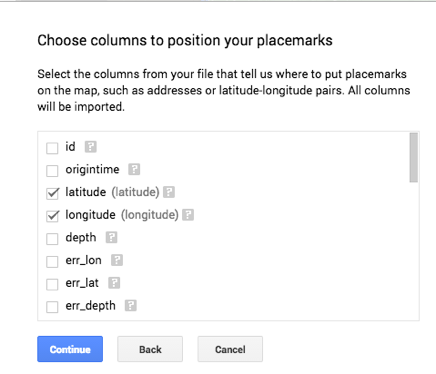
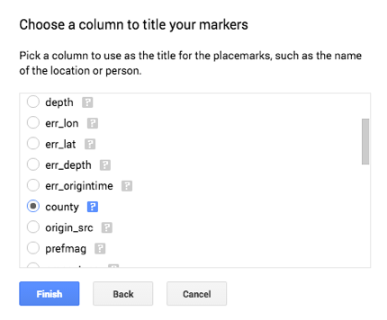
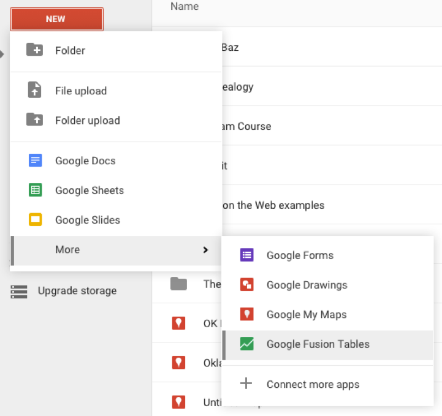
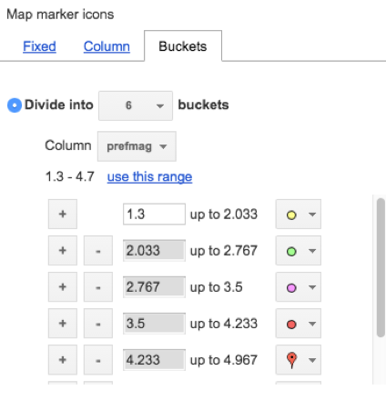
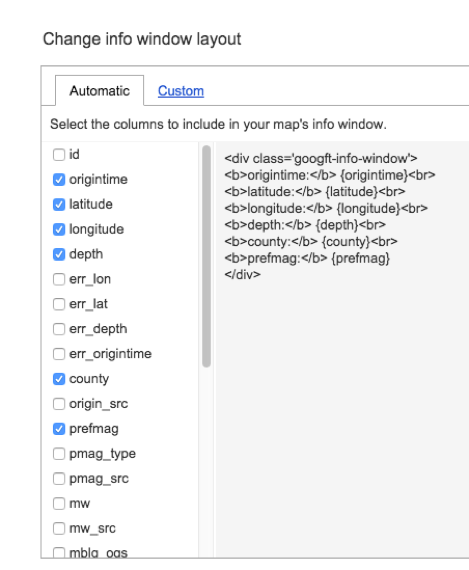
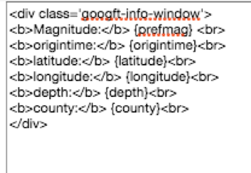
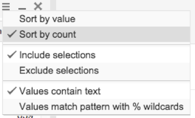
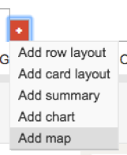

## About
Last Updated September 2016   
Created by [Sarah Clayton](https://github.com/sclayton29) and Jeffrey Widener

## Table of Contents
* [Introduction](#introduction)
* [Downloading the Data](#downloading-the-data)
* [Google Maps](#google-maps)
  * [Getting Started](#getting-started)
  * [Importing Data](#importing-data)
  * [Styling and Analyzing your Map](#styling-and-analyzing-your-map)
  * [Sharing your Map](#sharing-your-map)
* [Google Fusion Tables](#google-fusion-tables)
  * [Opening and Loading Data](#opening-and-loading-data)
  * [Changing Icons](#changing-icons)
  * [Changing Info Window](#changing-info-window)
  * [Filter](#filter)
  * [Heat Map](#heat-map)
  * [Sharing Maps](#sharing-maps)

## Introduction
This lesson will walk you through how to quickly create maps using google maps and google fusion tables. 
For this example, we will be mapping earthquakes in Oklahoma from 2015.  

[Return to Top](#about)

## Downloading the Data
For this exercise, you will need to create a Google account If you do not already have one. You can create an account at https://accounts.google.com/SignUp.

Today, we will use multiple tools to map Oklahoma earthquake data from 2010 and 2015. First, we need to download our data. We will use comma-separated values (CSV) files made available by the Oklahoma Geological Survey. 

First, navigate to the OGS’s website (http://www.ou.edu/ogs). In the navigation bar on the left side, click Earthquake Catalogs. This will take you to the list of available data. Click on 2015 and download the 2015.csv file. Repeat for the 2010 dataset. 

Examine the data. Some of the headers may make sense to you. Some may not. If you collapse the Earthquake Catalogs on the OGS website, you can click on Catalog Header Descriptions to see a description of each of the headers.  

*If this was your data, would you want to do any clean up work on it?* 

[Return to Top](#about)

## Google Maps
### Getting Started
Now that we have our data, we can start making our map! Go to http://google.com/mymaps
Click Create a New Map. If you are not already signed into your Google account, this will take you to a log in page. Please sign into your account. 

You should now see a map of the United States (Google base map), search bar with icons across the top, and a white box (Mapbox) on the upper left. See image below.

Click on Untitled Map. This will open a dialog box for editing the map title and description. Enter OK Earthquakes as you title. You can put anything in the description, but I like to add my data source including the URL. Click save.

[Return to Top](#about)

### Importing Data
Now, click “Import” in your newly titled Map Box. 

This opens a dialog box for you to select your files. We want to import the 2015 OK Earthquake data. If you click “Select a file from your computer,” you can navigate to the 2015.csv (if you didn’t move this, it should be in your downloads folder). 

After you select your file, you will be prompted to choose columns to position your placemarks. These are the columns that the position of points on the map.  

Make sure latitude and longitude are checked. Click continue. 

Title your markers by county. Click Finish.  

You may have to wait a few moments for your file to import. 

Once the import has completed, in your Mapbox, you should see your file that you just imported. It’s now called a layer file. If you think of your map as a layer cake, the Google base map is your base, and you’ve just added a layer of sprinkles on top. 

Click Add layer and repeat the import process for your 2010.csv file. 

Notice you can uncheck the box beside the layer name to remove it from the map. 

The layer you just imported is given the same name as the file we uploaded by default. By clicking on the layer name, we can change it. Underneath 2015.csv, you can see that layer consist of 2,000 items. If you open the original csv file, you will notice that it has 5,776 rows. Google maps can only handle 2,000 records per layer. What we have really mapped is the first 2,000 records. This is important to remember when selecting a tool for your project. Our 2010 csv file only contains 1061 records so all of them are mapped. 
[Return to Top](#about)

### Styling and Analyzing your Map
We can change the style to see how we can use the map to quickly answer questions about our data. You can repeat this exercise for 2010 and 2015. 

Click “Uniform style.” In the “Group places by” dropdown menu, select “county” in the “Style by data column.”

1. Which of your counties(top 3) had the most earthquakes?
2. Which of your couties (bottom 3) had the fewest earthquakes occur?
  
  
Switch your mapped style to 'prefmag.'
1. What magnitude was the largest earthquake? Where did this earthquake occur?
2. Describe the landscape around this large earthquake occurrence (this may require you to change your basemap). 
3. What’s the most common magnitude out of all of the earthquakes? 

Change your “prefmag” symbolization from categories to ranges and change it to show 5 ranges. You can change your range color preference in the option. Pick whatever makes the most sense to you. 

Before we move on, let’s look at one final feature. Under the search bar, there is a ruler icon. This will enable us to quickly measure distances. Click on the ruler. Then, click on one of your points. You can click on as many as many points as you would like. Double click to end your measurement. 

If you want to do more powerful geospatial analysis, you probably will want to switch to a different (or more complicated) tool like ArcGIS or QGIS. 
[Return to Top](#about)

### Sharing your Map

To share your map, click the Share button above your layer name. This will provide you with a link you can send to anyone and the opportunity to invite people to view or edit your map. 

[Return to Top](#about)

## Google Fusion Tables
### Opening and Loading Data
Google Fusion tables are another way to map your data. In this exercise, we will map points and create a heat map from our 2015 earthquake data. 

Go to http://drive.google.com. Sign in if you aren’t already. Click the red New button. Click More. Click Google Fusion Tables

Now you can import your table. Click Choose File and select your 2015 data (2015.csv). You can leave all of the default settings (Comma and UTF-8). 

You should now see a preview of your table. Click Next. 

Give your Table a title. I’ll call mine Earthquakes in OK in 2015. 

I will also attribute my data to the Oklahoma Geological Survey and include a link to my data source in the Attribution page link. 

Click Finish.

Now, you should see the full table. Notice that unlike Google maps, all of the data was imported. 

There are three tabs located across the top of the table. Rows 1 shows your table. Cards 1 display each record individually. The final tab, Map of latitude, shows all of your data points on a map based on their lat/long pairs. 

Click on Map of latitude and zoom into Oklahoma. 

[Return to Top](#about)

### Changing Icons
On the right side of the screen you can see options to configure your map. Let’s show different sized earthquakes with different icons.  Click “Change features styles..” This will open up a dialog box where we can change the icons. 

lick on Buckets, and select to divide into 6 buckets. Select to use the column “prefmag” and click “use this range” to automatically change your bucket values to make the range in the prefmag column. 

You can then change the icons for each bucket. There are 10 icons available by default. Select a combination that you think will make the most sense to a viewer. 

Click Save. Your changes should be reflected on your map. 

[Return to Top](#about)

### Changing Info Window
Trying click on one of your points.  A pop up window should appear listing information about that point. This is called the info window. We can control what appears in the information window. 

On the right side of the page, click “Change info window…” 

By default, the info window shows the first 10 columns in your data table.  Let’s change our info window to show the origin time, latitude, longitude, depth, county, and prefmag. To do this, check those boxes in the Change info window layout dialog box. 

Click Save.

When you click on a point on the map, the time, lat/long, depth, county, and prefmag will appear. 

This may not be the way or order you want to display your information. So, let’s change it. 

Click “Change info window” again. 

This time click on Custom at the top of the box. 

You will see the same information as before but now you can edit the html on the right. Any value in {} represents the data that will be pulled from your map. 

A good approach to editing this is to use copy and paste. Copy the bottom line, <b>prefmag:</b> {prefmag}, and paste it at the top. Let’s change the first prefmag: to Magnitude so can be better understood by viewers who are not familiar with the headers in our dataset. 

Click Save. 

[Return to Top](#about)

### Filter
One nice feature is the ability to easily filter the data displayed on the map. 

To test this, let’s create a filter to only show earthquakes in the counties that had over 500 earthquakes in 2015. 

Click on the blue Filter button in the top right. Select county. 

Click the three horizontal lines and select sort by count. 

Check the counties with over 500 earthquakes (Grant, Logan, Alfalfa, Noble, and Garfield). Your map will apply the filters as you select the boxes. 

Click the arrow in the top left corner of the filter box to hide it. Notice that your filter appears on the top of your map. 

You can combine filters to target very specific elements of your dataset.

[Return to Top](#about)

### Heat Map
Google fusion tables will allow us to create heat maps for our data. 

Let’s create a new map so we can preserve our current filtered map. Next to the Map of latitude at the top. Click the red plus sign. Select new map.

A new tab will appear labeled Map 2. Click Map 2. Select Rename. Call your new map Heatmap. 

Under Configure Map, click Heatmap. Your map is chagned from a feature map to a heat map upon click. 

There is one major caveat with the heatmaps. If you look at the top of the screen, you should see a yellow map that says “Showing 1000 of 5776 points.” Unlike the feature maps, the heatmap has a limit of 1,000 records. You can get around this limitation by filtering down your records. 

Create a Filter to only show the earthquakes in Oklahoma County. The warning message should no longer appear. 

You can change the appearance of your heatmap in three ways. 

The radius slider sets the radius in pixels. The opacity slide changes how transparent the colors are. 

The weight column is optional. If you choose to use this column, each point’s importance will by adjusted by multiplying its intensity by the specified column. 

[Return to Top](#about)

### Sharing Maps
To share your map, click on the title. 

Click Publish. This will provide you with a link to the map as well as an embed code for your map. 

[Return to Top](#about)
